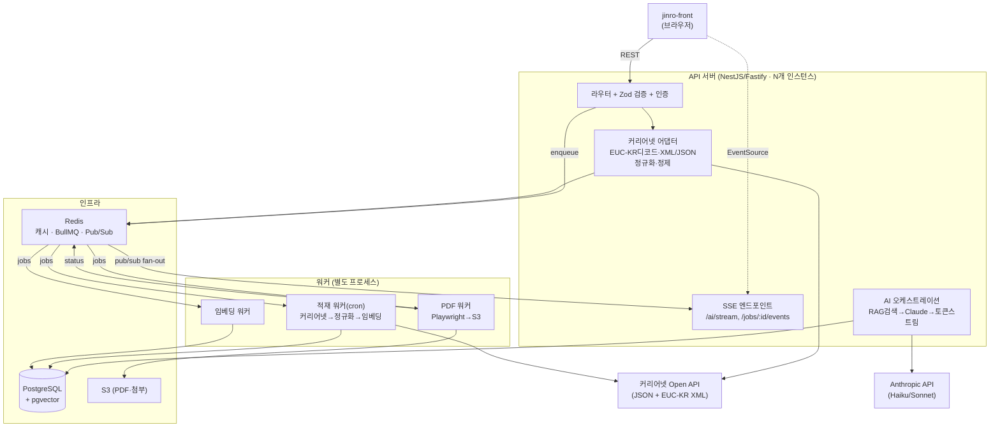

# 진로나침반 백엔드 — 아키텍처 · 스택 비판 · Claude Code 프롬프트 세트

> 작성 기준: 2026-06. 업로드된 **커리어넷 Open API 매뉴얼 v4.1** + **공식 예제(jobdiclist/jobdicview.html)** 분석 + 최근 문서 기준 스택 검토.

---

## 0. 이 문서를 어떻게 쓰는가

제가 로컬 `Desktop/jinro-front`를 직접 열 수 없으므로, 이 문서는 두 부분으로 구성됩니다.

- **A. 판단 자료 (1~7장)** — "프론트만 보고 백엔드를 짜라"는 결정을 내리기 위한 아키텍처/스택/에러/PDF 설계. 제가 직접 검증한 내용.
- **B. 실행 프롬프트 (8장)** — `jinro-front`를 **실제로 읽고** 그 계약(routes·fetch·데이터 모양·env)에 맞춰 백엔드를 생성하도록 **Claude Code에 그대로 붙여넣는** 프롬프트 세트.

즉 8장이 "프론트만 보고 구현" 요구의 실체이고, 1~7장은 그 프롬프트가 흔들리지 않도록 박아 넣은 설계 가드레일입니다.

---

## 1. 진단 — 업로드 자료에서 드러난 사실

공식 예제(`jobdiclist.html`, 2019)는 그대로 쓰면 안 되는 안티패턴 집합입니다.

```js
// 공식 예제 — 클라이언트에서 직접 호출
axios.get('http://www.career.go.kr/cnet/openapi/getOpenApi?apiKey=631411887293319c018c3eeeb7413e40&...')
```

여기서 백엔드의 **존재 이유 3가지**가 그대로 도출됩니다.

| # | 문제 (예제에서 실측) | 백엔드가 해결하는 것 |
|---|---|---|
| 1 | `apiKey`가 클라이언트 JS에 노출. `http://` 평문. | **프록시** — 키는 서버 환경변수, 항상 HTTPS |
| 2 | 일부 응답은 `encoding="euc-kr"` XML, 일부는 JSON | **정규화 레이어** — EUC-KR→UTF-8 디코딩 + XML/JSON 통합 스키마 |
| 3 | "이용량에 따라 사용이 제한될 수 있습니다"(매뉴얼 명시) | **캐시 + 자체 적재(ingestion)** — 런타임을 커리어넷 레이트리밋에서 분리 |
| 4 | dirty data: `"null"`(문자열), `<br>`/`&lt;/br&gt;`, `\r\n` 리터럴, 오타("사스템소프트웨어") | **sanitization** — 방어적 파싱 + 정제 |

여기에 진로나침반 고유 요구가 둘 더 붙습니다.

- **AI 진로상담** — Claude(Haiku 비용 최적) + 커리어넷 RAG 컨텍스트, **SSE 토큰 스트리밍**.
- **PDF 리포트** — 진단 결과를 한글·차트 포함 PDF로 **정상 저장**(6장).

---

## 2. 커리어넷 API 지도 (v4.1) — 통합 시 함정

엔드포인트가 **두 계열**로 갈립니다. 이 차이를 어댑터가 흡수해야 합니다.

| 도메인 | 엔드포인트 | 포맷 | 비고 |
|---|---|---|---|
| 진로심리검사 v1 | `/inspct/openapi/test/questions`, `/test/report` | JSON | 검사번호별 답변 포맷 상이(24·25번 49번 문항 쉼표 3개, 32번 더미문항 등) |
| 진로심리검사 v2 (직업흥미 H) | `/inspct/openapi/v2/tests`, `/v2/test`, `/v2/report` | JSON | 121~146번은 규준 무관이나 **전송 필수** |
| 직업백과 | `/cnet/front/openapi/jobs.json`, `/job.json?seq=` | JSON | RAG 1순위 소스 (500+ 직업) |
| 주니어직업정보 | `/cnet/front/openapi/juniorjobsinfo.json`, `/juniorjobinfo.json` | JSON | 초·중학생용 |
| 학교정보 | `/cnet/openapi/getOpenApi?svcCode=SCHOOL` | **XML(euc-kr)** / json | `contentType`로 json 선택 가능하나 신뢰 말 것 |
| 학과정보 | `getOpenApi?svcCode=MAJOR / MAJOR_VIEW` | **XML(euc-kr)** | 상세는 `<department>`에 수백 개 학과명 쉼표 나열 |
| 진로상담사례 | `getOpenApi?svcCode=COUNSEL / COUNSEL_VIEW` | **XML(euc-kr)** | `<answer>`에 `&lt;/br&gt;` 섞임 |
| 진로교육자료 | `getOpenApi?svcCode=COSE / COSE_VIEW` | **XML(euc-kr)** | `<attFile>` 다운로드 URL 콤마 다중 |

**어댑터가 반드시 처리할 함정**

1. **EUC-KR**: `getOpenApi` 계열은 바이트로 받아 `iconv-lite`로 디코딩. `res.text()`로 바로 받으면 한글 깨짐. (프론트 `<meta charset=euc-kr>` 잔재가 보이면 이 흔적)
2. **응답 형태 불안정**: `count`가 string으로 오거나, 배열이어야 할 게 단일 객체로 오는 케이스. 파서가 항상 배열 정규화.
3. **`"null"` 문자열 / 빈 문자열** → `null`로 치환 (예제도 `item.similarJob == 'null' ? ''` 로 우회 중).
4. **HTML 잔재**: `<br>`, `&lt;/br&gt;`, `\r\n`, 앞뒤 공백 → strip/normalize.
5. **레이트리밋·간헐 장애**: 타임아웃 + 지수 백오프 + 서킷브레이커. 런타임 직접 의존 금지 → **주기적 ingestion으로 자체 DB에 적재**.

---

## 3. 추천 스택 (최근 문서 기준 + 비판)

### 결정 테이블

| 영역 | 추천 | 비판적 사유 / 대안 |
|---|---|---|
| 런타임 | **Node.js 22 LTS**(또는 24 LTS) | native `fetch`, undici, SSE 안정. 신규 LTS면 24도 무방 |
| 프레임워크 | **NestJS** (기본) / Fastify (린) | Nest는 `@Sse()` 데코레이터·`@nestjs/bullmq`·DI로 프록시/정규화/큐 모듈화에 유리. **단, 오버헤드 큼** → 단일 목적 고성능이면 Fastify. *프론트의 기존 백엔드 관행이 있으면 그걸 우선* |
| DB / ORM | **PostgreSQL + Prisma** | 이미 사용 중. RAG 위해 **pgvector** 확장 |
| 캐시·큐 | **Redis(ioredis) + BullMQ** | BullMQ가 2026 신규 프로젝트 사실상 표준(Bull은 유지보수 모드). Redis는 캐시·SSE 팬아웃·큐 3역 |
| AI | **Anthropic SDK** — Haiku(라우팅/요약·저비용) + Sonnet(최종 리포트 합성) | **프롬프트 캐싱**으로 시스템프롬프트+RAG 컨텍스트 재사용해 비용 절감 |
| 임베딩 | Voyage `voyage-3` / OpenAI `text-embedding-3` / `bge-m3`(셀프호스트) | 한국어 품질이 변수 → **인터페이스로 추상화**해 교체 가능하게 |
| PDF | **Playwright(Chromium)** in BullMQ worker → S3 | 차트+한글 리포트는 브라우저 렌더만이 현실적. Playwright가 Puppeteer보다 컨텍스트 격리/메모리 우위(6장) |
| 저장소 | **AWS S3** | 이미 사용. PDF·첨부는 S3, 응답은 presigned URL |
| 검증 | Zod (Fastify) / class-validator (Nest) | 외부(커리어넷) 응답도 **방어적 스키마 검증** |
| 회복탄력성 | `p-retry` + `opossum`(서킷) + single-flight | 캐시 스탬피드/외부 장애 흡수 |
| 관측성 | `pino` + Sentry (+ OTel 선택) | "오류 모두 잡기"의 수집 채널 (7장) |

### 비판 포인트 3개

- **"BullMQ + Streams + Redis Q 다 넣자"는 과설계입니다.** BullMQ가 내부적으로 Redis Streams 위에서 돕니다. raw Streams를 직접 쓸 이유는 **Outbox 이벤트 버스/리플레이**가 필요할 때뿐(5장).
- **NestJS는 공짜가 아닙니다.** 진로나침반이 "라이브로 빨리 키우는 제품"이면 구조화 이득이 크지만, 1~2명이 속도전이면 Fastify+얇은 레이어가 더 빠릅니다. 프론트의 기존 관례를 먼저 따르세요.
- **임베딩 모델을 지금 못 박지 마세요.** 한국어 RAG 품질은 모델별 편차가 크고, 커리어넷 텍스트는 짧고 정형적이라 BM25(Postgres `tsvector`) **하이브리드**가 순수 벡터보다 나을 수 있습니다. 어댑터로 추상화.

---

## 4. 아키텍처



**모듈 구성(권장)**

```
src/
  career/          # 커리어넷 어댑터: client, decode(euc-kr), normalize, sanitize, cache, types
  ai/              # RAG retriever + Claude orchestrator + SSE streamer
  report/          # PDF 템플릿(HTML) + 생성 요청 API
  jobs/            # BullMQ 큐/워커: pdf, ingest, embed (워커는 별도 엔트리포인트)
  realtime/        # SSE 게이트웨이 + Redis pub/sub 브리지 + heartbeat
  common/          # 에러필터, 로거(pino), 재시도/서킷, presigned URL, env(zod)
  db/              # Prisma schema (+ pgvector)
worker.ts          # 워커 전용 부트스트랩 (API와 분리 배포)
```

---

## 5. SSE vs BullMQ vs Redis Streams vs Pub/Sub — 무엇을, 언제 (비판적 정리)

네 가지를 **역할이 다른 도구**로 명확히 가르는 게 핵심입니다. 겹쳐 쓰면 디버깅이 지옥이 됩니다.

| 도구 | 한 줄 정의 | 진로나침반에서 쓰는 곳 | 안 쓰는 곳 |
|---|---|---|---|
| **SSE** | 서버→클라 단방향 HTTP 푸시 | AI 토큰 스트리밍, PDF/적재 **진행상황** 푸시 | 양방향 필요 시(여기선 없음) |
| **BullMQ** | Redis 기반 **내구성 잡 큐**(재시도·스케줄·DLQ) | PDF 생성, 커리어넷 적재(cron), 임베딩 | 실시간 브라우저 푸시(그건 SSE) |
| **Redis Pub/Sub** | 휘발성 팬아웃 | **다중 API 인스턴스 SSE 동기화**(워커→해당 연결 보유 인스턴스로 이벤트 전달) | 영속/리플레이 필요 시 |
| **Redis Streams** | 내구성 이벤트 로그 + 컨슈머그룹 + 리플레이 | **(선택)** Outbox 이벤트 버스, 감사 로그 | 일반 잡 처리 — **BullMQ가 이미 Streams 위에서 돈다** |

**2026 기준 정설 (리서치 반영)**

- **AI 스트리밍·알림은 SSE가 기본값.** 모든 주요 AI 챗 제품이 SSE 사용. 단방향이면 WebSocket/gRPC는 과함(스케일·재연결 복잡도만 증가). `EventSource`는 끊겨도 **자동 재연결 + `Last-Event-ID`**로 재개 → 토큰 낭비 방지.
- **SSE 프로덕션 체크리스트**: `heartbeat`(주석 라인 주기 전송), `X-Accel-Buffering: no`(nginx 버퍼링 해제), HTTP/2(도메인당 6커넥션 한계 회피), 멀티 인스턴스는 **Redis Pub/Sub**로 팬아웃, **sticky session 지양**, 클라 disconnect 시 정리.
- **잡 큐는 BullMQ가 신규 표준**(Bull은 유지보수 모드). **CPU 무거운 작업(PDF 생성)을 요청 핸들러에서 돌리면 이벤트 루프가 막혀 다른 요청을 굶긴다** → 반드시 워커로.

**결론(과설계 경고):** 진로나침반에는 **BullMQ(잡) + Pub/Sub(SSE 팬아웃)** 조합이면 충분합니다. raw Redis Streams는 Outbox 패턴(이미 익숙하시죠)으로 **이벤트 리플레이/감사**가 필요할 때만 추가하세요. "다 쓰자"는 유혹을 비판적으로 거르는 게 이 설계의 핵심입니다.

---

## 6. PDF "정상 저장" 전략 (가장 어려운 부분)

리서치 결론: **Chromium 기반 PDF는 "그냥 되는" 게 아니라 "운영하면 깨지는"** 영역입니다. 좀비 프로세스·메모리 누수·폰트 폴백이 3대 실패 원인.

**설계 원칙 (정상 저장 = 이 7개를 다 지킬 때)**

1. **요청 핸들러 인라인 금지.** PDF는 **BullMQ 전용 워커**에서. API는 잡만 enqueue하고 `jobId` 반환, 완료는 SSE/폴링으로 통지.
2. **브라우저 1개 재사용 + 잡마다 `BrowserContext`.** 매 요청 `launch()` = 메모리 폭증·좀비. Playwright `browserContext`로 격리 후 `context.close()`.
3. **한글 폰트를 이미지에 임베딩.** *폰트는 dev/prod 렌더 차이의 1순위 원인.* Docker에 `Pretendard` 또는 `Noto Sans KR`를 설치하고 CSS `@font-face`로 명시. 시스템 폰트에 의존하면 운영에서 □□□.
4. **모든 단계에 타임아웃 + 크래시 복구.** `page.goto({waitUntil:'networkidle'})` + 타임아웃, 차트 렌더 완료 시그널(예: `window.__chartReady=true`) 대기. 브라우저 죽으면 워커가 재기동 후 재시도.
5. **OOM 가드.** 컨테이너 메모리 ≥1.5GB, 동시 렌더 수 제한(워커 concurrency 1~2), 잡 간 `context` 확실히 닫기. 누수 의심 시 N잡마다 브라우저 재시작.
6. **출력은 S3, 응답은 presigned URL.** 로컬 디스크 저장 금지(인스턴스 휘발). 멱등키로 동일 요청 중복 생성 방지.
7. **DLQ + 실패 알림.** 재시도 소진 시 Dead Letter로 보내고 Sentry 기록 → "조용한 실패" 차단.

> 대안: 차트 없는 단순 리포트면 `pdfkit`/`pdfmake`(브라우저 불필요, 가벼움). Chromium 격리를 통째로 떼고 싶으면 **Gotenberg**를 별도 컨테이너 마이크로서비스로. 단, 진로나침반 리포트는 차트·한글 레이아웃이 핵심이라 **Playwright 권장**.

---

## 7. "오류 모두 잡기" — 계층별 에러 전략

"모두 잡으라"는 try/catch 도배가 아니라 **계층마다 다른 실패를 다른 방식으로** 처리하는 것입니다.

| 계층 | 잡아야 할 실패 | 처리 |
|---|---|---|
| 입력(edge) | 잘못된 파라미터/바디 | Zod/class-validator로 거르고 400 + 표준 에러 바디 |
| 커리어넷 어댑터 | 타임아웃, 5xx, EUC-KR 깨짐, XML 파싱 실패, dirty data | 타임아웃→재시도(지수 백오프)→서킷브레이커. **외부 응답도 스키마 검증**. `"null"`/`<br>`/`\r\n`/엔티티 정제. 실패 시 캐시/적재본으로 폴백 |
| AI 레이어 | 429(레이트리밋), 529(overloaded), 컨텍스트 초과, 콘텐츠 필터, **스트림 중간 끊김** | 백오프 재시도, 토큰 예산 가드, 스트림 중 에러는 **SSE `event: error`로 전달** 후 정리 |
| 잡 레이어 | 잡 실패/중복/유실 | BullMQ 재시도 + **DLQ** + **멱등키**(Outbox로 정확히-한-번 효과) |
| PDF | 브라우저 크래시, OOM, 폰트 누락, 렌더 타임아웃 | 6장 전체 + 폰트 누락 감지 시 명시적 실패 |
| 전역 | 미처리 예외 | 에러 필터로 **정규화된 에러 응답 형태** 통일, 내부 스택 비노출, pino 구조화 로그 + Sentry |
| SSE | 클라 끊김, 백프레셔, 좀비 커넥션 | heartbeat, `req.on('close')` 정리, write backpressure 처리 |

**표준 에러 응답 형태(예)**

```jsonc
{ "error": { "code": "CAREERNET_UPSTREAM_TIMEOUT", "message": "사용자용 안전 메시지", "traceId": "..." } }
```

내부 원인은 `traceId`로 로그에서 추적, 클라엔 코드+안전 메시지만. 이게 "모두 잡되 새지 않게"의 핵심입니다.

---

## 8. Claude Code 프롬프트 세트 (실제 실행용)

`jinro-front` 옆에 `jinro-back`을 만들고, Claude Code를 **`jinro-front`를 읽을 수 있는 위치**에서 실행한 뒤 아래를 **순서대로** 붙여넣으세요. 각 프롬프트는 이전 산출물(특히 `PRD.md`/`CLAUDE.md`)을 전제로 합니다. CLAUDE.md/PRD.md/MEMORY.md 방식 그대로입니다.

### Prompt 0 — 정찰(프론트 계약 추출) ⚠️ 코드 작성 금지

```text
너는 시니어 백엔드 아키텍트다. 아직 코드를 한 줄도 쓰지 마라.
../jinro-front 디렉터리 전체를 읽고, 백엔드가 만족시켜야 할 "계약"을 역추출해 docs/FRONTEND_CONTRACT.md로 정리하라.

추출 항목:
1. 프론트가 호출하는 모든 API: 메서드, 경로, 쿼리/바디 스키마, 기대 응답 모양(필드명·타입), 호출 위치(파일:라인).
2. 인증/세션 방식(헤더, 쿠키, 토큰 저장 위치).
3. SSE/스트리밍/폴링을 기대하는 지점(EventSource, fetch stream, 로딩 UI가 토큰 단위인지).
4. 커리어넷 관련 흔적(apiKey 노출, euc-kr, 직업/학과/학교/검사 데이터 모양).
5. 파일 업로드/다운로드, PDF 다운로드 트리거.
6. 프론트가 기대하는 환경변수/baseURL/CORS origin.
7. 데이터 모델 후보(엔티티·관계).

규칙:
- 추측 금지. 코드에 있는 근거만, 파일:라인으로 인용.
- 불명확하면 "OPEN QUESTION"으로 별도 목록.
- 출력은 FRONTEND_CONTRACT.md 하나. 끝나면 OPEN QUESTION만 콘솔에 요약.
```

### Prompt 1 — 스택 확정 + 스캐폴드

```text
docs/FRONTEND_CONTRACT.md를 기준으로 백엔드를 스캐폴드하라.

스택(이유 있으면 프론트 관례를 우선, 변경 시 docs/DECISIONS.md에 근거 기록):
- Node 22 LTS, TypeScript strict
- 프레임워크: NestJS (프론트에 기존 백엔드 관례가 있으면 그걸 따르고 DECISIONS.md에 기록)
- PostgreSQL + Prisma (+ pgvector 확장)
- Redis(ioredis) + BullMQ
- 검증: zod (Nest면 class-validator 허용)
- 로깅: pino, 에러수집 자리: Sentry(키 없으면 no-op)
- 설정: zod로 env 스키마 검증, 누락 시 부팅 실패

산출:
- 위 "모듈 구성" 구조대로 폴더 생성 (career/ ai/ report/ jobs/ realtime/ common/ db/)
- worker.ts: BullMQ 워커 전용 엔트리포인트(API와 분리 실행)
- Dockerfile + docker-compose(postgres+pgvector, redis 포함)
- 표준 에러필터 + 표준 에러 응답 형태 { error:{ code,message,traceId } }
- /health, /ready 엔드포인트
- README에 실행법

아직 비즈니스 로직은 stub. 타입과 경계만 잡아라.
```

### Prompt 2 — 커리어넷 어댑터 (프록시·정규화·캐시·적재)

```text
career/ 모듈을 구현하라. 첨부 지식: 커리어넷 Open API v4.1.

요구:
1. client: HTTPS 고정, apiKey는 env에서만. 타임아웃 + p-retry 지수백오프 + opossum 서킷브레이커.
2. 두 계열 처리:
   - JSON 계열: /cnet/front/openapi/jobs.json, /job.json, juniorjobsinfo.json, /inspct/openapi/v2/*
   - EUC-KR XML 계열: /cnet/openapi/getOpenApi (svcCode=SCHOOL/MAJOR/COUNSEL/COSE). 반드시 바이트로 받아 iconv-lite로 euc-kr→utf-8 디코딩 후 xml 파싱.
3. normalize: XML/JSON을 단일 내부 타입으로 통합. 배열이어야 할 필드는 항상 배열로.
4. sanitize: "null"문자열→null, <br>/&lt;/br&gt; 제거, \r\n·중복공백 정리, 앞뒤 trim, 오타/깨진 값 방어.
5. 외부 응답을 zod로 방어적 검증(필드 누락/타입불일치 허용 후 로깅).
6. 캐시: Redis 캐시 + single-flight(동시 캐시미스 합치기)로 스탬피드 방지. TTL은 도메인별.
7. ingestion 워커(jobs/): cron으로 직업백과/학과/주니어직업을 적재→정규화→PostgreSQL upsert. 런타임이 커리어넷에 직접 의존하지 않도록.
8. 단위 테스트: euc-kr 디코딩, dirty data 정제, 배열 정규화 케이스.

프론트가 기대하는 응답 모양(FRONTEND_CONTRACT.md)에 정확히 맞춰 컨트롤러를 노출하라.
```

### Prompt 3 — AI 진로상담 (RAG + Claude + SSE 스트리밍)

```text
ai/ + realtime/ 모듈을 구현하라.

요구:
1. RAG retriever: pgvector 임베딩 검색 + Postgres tsvector(BM25 유사) 하이브리드. 임베딩 모델은 인터페이스로 추상화(EmbeddingProvider)해 교체 가능하게. 컨텍스트 소스는 career/가 적재한 직업·학과·상담사례.
2. Claude 오케스트레이션: Anthropic SDK. 저비용 단계는 Haiku, 최종 리포트 합성은 Sonnet. 시스템프롬프트+RAG 컨텍스트에 prompt caching 적용.
3. 스트리밍: Claude 스트림을 SSE로 중계. event: token / event: done / event: error. heartbeat, X-Accel-Buffering:no, 클라 disconnect 시 Anthropic 스트림 abort.
4. 멀티 인스턴스 대비: 워커/다른 인스턴스 이벤트는 Redis Pub/Sub로 팬아웃해 SSE 연결 보유 인스턴스가 전달.
5. 에러: 429/529/컨텍스트초과/콘텐츠필터/스트림중단을 각각 처리하고 사용자엔 안전 메시지.
6. 토큰/비용 가드: 입력 컨텍스트 길이 상한, 요청당 max_tokens.

프론트의 스트리밍 기대(Prompt 0에서 확인한 EventSource/loading UX)와 정확히 맞물리게 하라.
```

### Prompt 4 — PDF 리포트 (Playwright + BullMQ + S3)

```text
report/ + jobs/(pdf 큐) 모듈을 구현하라. 절대 요청 핸들러에서 PDF를 생성하지 마라.

요구:
1. API: POST /reports → 잡 enqueue 후 { jobId } 반환. 진행/완료는 SSE(/jobs/:id/events) 또는 GET /reports/:id로.
2. PDF 워커(별도 프로세스):
   - Playwright Chromium 브라우저 1개 재사용 + 잡마다 BrowserContext 생성/종료.
   - HTML 템플릿 렌더(진단결과·차트). 차트 렌더 완료 시그널 대기(window.__chartReady).
   - 한글 폰트: Docker에 Pretendard/Noto Sans KR 설치 + CSS @font-face 명시(시스템폰트 의존 금지).
   - 모든 단계 타임아웃. 브라우저 크래시 시 재기동 후 재시도. N잡마다 브라우저 재시작(누수 방지).
   - 동시성 1~2로 제한, 컨테이너 메모리 ≥1.5GB 가정.
3. 출력: S3 업로드 후 presigned URL 반환. 로컬 디스크 저장 금지. 멱등키로 중복 생성 방지.
4. 실패: BullMQ 재시도 소진 시 DLQ + Sentry. "조용한 실패" 금지.
5. 통합 테스트: 한글 깨짐 없는지(렌더된 PDF 텍스트 추출 검증), 차트 포함, 동시 5건 OOM 없이.
```

### Prompt 5 — 에러·관측성 하드닝

```text
"오류 모두 잡기"를 계층별로 마감하라.

1. 전역 에러필터: 모든 미처리 예외를 표준 { error:{code,message,traceId} }로. 내부 스택 비노출.
2. 각 도메인 에러 코드 enum 정의(CAREERNET_*, AI_*, PDF_*, VALIDATION_*).
3. pino 구조화 로깅 + 요청별 traceId 전파(AsyncLocalStorage). Sentry 연동(키 없으면 no-op).
4. 커리어넷/Anthropic 호출에 재시도·서킷·타임아웃이 누락된 곳 없는지 감사하고 보강.
5. BullMQ: 모든 큐에 재시도 정책·backoff·DLQ·removeOnComplete 설정. 멱등성 점검.
6. SSE: heartbeat·disconnect 정리·backpressure 처리 누락 점검.
7. 부하 가드: rate limit(IP/유저), 입력 크기 제한, AI 동시 요청 상한.
8. docs/RUNBOOK.md: 주요 실패 시나리오와 대응(커리어넷 다운, Anthropic 429, PDF 워커 OOM, Redis 끊김).
```

### Prompt 6 — 백엔드 PRD.md / CLAUDE.md 생성

```text
지금까지 구현을 바탕으로 백엔드 저장소용 컨텍스트 문서를 생성하라.

1. PRD.md: 진로나침반 백엔드의 목적, 도메인(커리어넷 프록시/AI상담/PDF리포트), 비기능요구(보안·레이트리밋·관측성), 외부 의존(커리어넷 v4.1, Anthropic, S3).
2. CLAUDE.md: 아키텍처 개요, 모듈 경계, 핵심 결정(SSE=스트림/BullMQ=잡/Pub-Sub=SSE팬아웃, Streams는 Outbox에만), 커리어넷 함정(euc-kr·dirty data), PDF 규칙(워커격리·폰트·S3), 에러 규약, 자주 하는 실수 금지 목록.
3. MEMORY.md: 미해결 OPEN QUESTION, TODO, 다음 이터레이션 후보.
```

---

## 9. 다음 단계 / 제가 더 해드릴 수 있는 것

- 위 프롬프트 중 **Prompt 0을 먼저 돌려** 나온 `FRONTEND_CONTRACT.md`(또는 OPEN QUESTION)를 여기 붙여주시면, 실제 프론트 계약에 맞춰 프롬프트를 **정밀 튜닝**해 드립니다.
- 원하시면 ① 커리어넷 어댑터의 **EUC-KR 디코딩 + 정규화 레퍼런스 구현**(TypeScript)이나 ② **SSE+Claude 스트리밍 핸들러 골격**, ③ **Playwright PDF 워커 골격**을 바로 코드로 떠 드립니다.
- 이 문서를 백엔드 레포 `docs/`에 넣을 수 있게 **섹션별 파일 분리**(ARCHITECTURE.md / STACK_DECISIONS.md / PROMPTS.md)도 가능합니다.

어느 쪽부터 갈까요.
